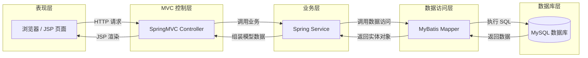
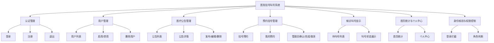

# 实验报告图稿

下面两张图对应报告第 2 章里的要求，直接复制到支持 Mermaid 的编辑器里即可渲染。

## 图 1 系统 MVC/SSM 分层架构图

## 图 2 系统功能模块结构图

## 使用建议

- 如果只放一张图，优先放“图 1 系统 MVC/SSM 分层架构图”。
- 如果老师要求“系统功能模块图”，就把“图 2”也放进报告。
- 这两张图和你当前代码结构是对得上的。

